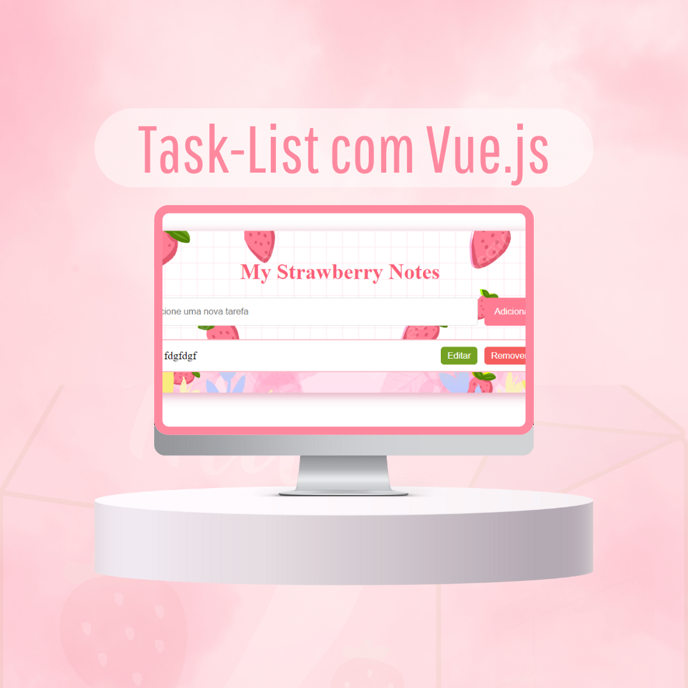

# My Strawberry Notes

 

## Descrição

**My Strawberry Notes** é uma aplicação simples de gerenciamento de tarefas desenvolvida em Vue.js. Permite que os usuários adicionem, editem e removam tarefas de forma intuitiva, além de marcar as tarefas como concluídas. A interface é amigável e colorida, ideal para quem busca uma maneira prática de organizar suas anotações e compromissos.

## Funcionalidades

- Adicionar novas tarefas.
- Editar tarefas existentes.
- Remover tarefas.
- Marcar tarefas como concluídas.
- Design responsivo e atraente.

## Tecnologias Utilizadas

- **Vue.js**: Framework JavaScript progressivo para construção de interfaces de usuário.
- **HTML5**: Estrutura básica da aplicação.
- **CSS3**: Estilização da interface.
